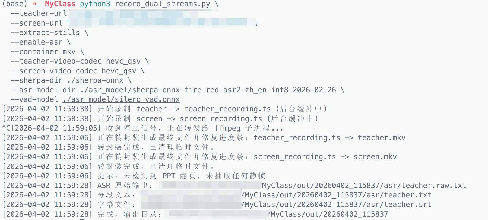
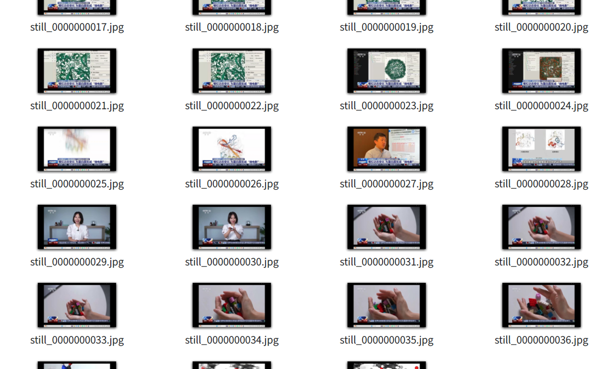
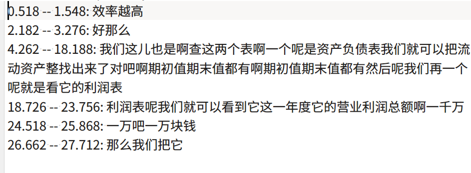

# 北京航空航天大学SPOC (BUAA SPOC) 录课系统复刻

**录制 / ASR / 降噪 一体化工具**

录制，ASR，降噪都可以分开来跑，所以也可以搭配 [我跟peter-erer合作的spoc脚本](https://github.com/peter-erer/buaa-spoc-helper)下载视频，然后生成字幕，提取PPT

目前最大的问题是ASR在我的CPU上只能跑到 0.7倍速，略慢。

降噪是为了解决某些教室混响严重，听不清老师说话，如果还要改进，打算加个[DeepFilterNet](https://github.com/rikorose/deepfilternet)

下面给的参数是为了intel核显用户优化的，用了QSV，会会快很多，用了HEVC编码视频，Opus编码音频是为了减小空间占用。

> **项目背景**
> 本工具为对北京航空航天大学 `spoc.buaa.edu.cn` 录课系统的复刻与增强。
> 原系统需等待回放生成、经常故障、且仅限有教务排课的科目使用（班会等无法录制）。
> 本项目使用全开源组件（FFmpeg + sherpa-onnx），实现本地化、零等待的双路录制与 AI 转写流程。

## 效果展示





## 📂 推荐目录结构

在开始之前，请确保你的工作目录结构如下（模型和工具需提前下载，见下文**环境准备**）：

```text
.
├── asr_model
│   ├── sherpa-onnx-fire-red-asr2-zh_en-int8-2026-02-26
│   │   ├── encoder.int8.onnx
│   │   ├── decoder.int8.onnx
│   │   ├── tokens.txt
│   │   └── test_wavs/ ...
│   └── silero_vad.onnx
├── out                              # 录制输出根目录（自动生成）
│   └── <session_name>/
│       ├── teacher.mkv
│       ├── screen.mkv
│       ├── logs/
│       └── screen_stills/
├── sherpa-onnx                      # sherpa-onnx 预编译包
│   ├── bin/sherpa-onnx-vad-with-offline-asr
│   ├── lib/
│   └── include/
├── record_dual_streams.py           # 本工具主脚本
└── README.md
```

---

## 🛠 环境准备与依赖

### 1. 基础依赖
- **Python 3.10+**
- **FFmpeg**（需带 `hevc_qsv` 和 `libopus` 支持，适用于 Intel 核显机器）
- **ffprobe**（通常随 ffmpeg 一起安装）

（当前只在Linux平台测试过，并且默认使用Intel核显的QSV编码器）

### 2. ASR 模型与工具下载
请下载以下内容并放到上述目录结构中指定的位置：

1. **sherpa-onnx 可执行文件**
   - 前往 [sherpa-onnx GitHub Releases](https://github.com/k2-fsa/sherpa-onnx/releases) 下载对应系统的预编译包（如 `sherpa-onnx-xxx-linux-x64-shared.tar.bz2`）。
   - 解压后重命名/放到项目根目录的 `sherpa-onnx/` 文件夹。

2. **FireRedASR2 Transducer 模型**（推荐，相比 CTC 准确率更高，能有效减少重复字和漏字）
   - 下载地址：[sherpa-onnx-fire-red-asr2-zh_en-int8-2026-02-26.tar.bz2](https://github.com/k2-fsa/sherpa-onnx/releases/download/asr-models/sherpa-onnx-fire-red-asr2-zh_en-int8-2026-02-26.tar.bz2)
   - 解压到 `asr_model/` 目录下。

3. **Silero VAD 模型**
   - 下载地址：[silero_vad.onnx](https://github.com/k2-fsa/sherpa-onnx/releases/download/asr-models/silero_vad.onnx)
   - 保存到 `asr_model/` 目录下。

---

## 🚀 快速开始

*(注：视频流地址暂不公开，同学们可自行探索 RTSP 摄像头流获取方式)*

```bash
python3 record_dual_streams.py \
  --teacher-url "你的教师机RTSP流地址" \
  --screen-url "你的屏幕RTSP流地址" \
  --extract-stills \
  --enable-asr \
  --container mkv \
  --teacher-video-codec hevc_qsv \
  --screen-video-codec hevc_qsv \
  --sherpa-dir ./sherpa-onnx \
  --asr-model-dir ./asr_model/sherpa-onnx-fire-red-asr2-zh_en-int8-2026-02-26 \
  --vad-model ./asr_model/silero_vad.onnx
```

执行完后，输出目录结构如下：

```text
out/<session_name>/
├── teacher.mkv              # 教师机录制（含降噪后的 Opus 音轨）
├── screen.mkv               # 屏幕流录制
├── logs/
│   ├── teacher_ffmpeg.log
│   ├── screen_ffmpeg.log
│   └── postprocess.log
├── screen_stills/
│   └── still_0000000001.jpg # 场景变化静帧
└── asr/
    ├── teacher_16k_mono.wav # 提取的 16k 单声道音频
    ├── teacher.raw.txt      # ASR 原始输出
    ├── teacher.txt          # 带时间戳的分段文本
    └── teacher.srt          # SRT 字幕文件
```

考虑到视频重编码与音频转码的兼容性，**也可将录制与 ASR 分两步执行**。

### 第一步：录制视频 + 提取屏幕静帧

```bash
python3 record_dual_streams.py \
  --teacher-url "你的教师机RTSP流地址" \
  --screen-url "你的屏幕RTSP流地址" \
  --extract-stills \
  --container mkv \
  --teacher-video-codec hevc_qsv \
  --screen-video-codec hevc_qsv \
  --record-audio-codec copy
```

### 第二步：对教师音频执行 ASR 识别

将第一步输出的 `teacher.mkv` 路径填入(也可以尝试用`screen.mkv`)。脚本已自动识别 Transducer 双文件架构，并默认开启 8 线程加速：

```bash
python3 record_dual_streams.py \
  --asr-input ./out/<刚刚生成的session目录>/teacher.mkv \
  --sherpa-dir ./sherpa-onnx \
  --asr-model-dir ./asr_model/sherpa-onnx-fire-red-asr2-zh_en-int8-2026-02-26 \
  --vad-model ./asr_model/silero_vad.onnx
```
执行完后，会在对应 session 目录下生成 `asr/` 文件夹，内含 `teacher.srt`（字幕）和 `teacher.txt`（纯文本）。

---

## 📖 其他使用场景

### 1. 仅对已有文件执行降噪
```bash
python3 record_dual_streams.py \
  --denoise-input /path/to/input.mp4 \
  --audio-output-format wav
```

### 2. 仅对已有文件执行 ASR
支持直接传入 mp4、mkv 甚至单声道 wav 文件：
```bash
python3 record_dual_streams.py \
  --asr-input /path/to/test_wavs/0.wav \
  --sherpa-dir ./sherpa-onnx \
  --asr-model-dir ./asr_model/sherpa-onnx-fire-red-asr2-zh_en-int8-2026-02-26 \
  --vad-model ./asr_model/silero_vad.onnx
```

### 3. 仅对已有视频提取静帧（原生 FFmpeg 命令）
如果你只想单独抽帧，可以直接用 ffmpeg（已规避 deprecated 像素格式警告）：

**场景变化抽帧（默认阈值 0.08）：**
```bash
ffmpeg -hide_banner -y \
  -i input.mp4 \
  -vf "select='gt(scene,0.08)',showinfo" \
  -fps_mode vfr \
  -pix_fmt yuv420p -color_range pc \
  -q:v 2 still_%010d.jpg
```

**固定间隔抽帧（例如每 80 帧取一张）：**
```bash
ffmpeg -hide_banner -y \
  -i input.mp4 \
  -vf "select='not(mod(n,80))',showinfo" \
  -fps_mode vfr \
  -pix_fmt yuv420p -color_range pc \
  -q:v 2 still_%010d.jpg
```

---

## ⚙️ 核心参数速查

### 录制控制
| 参数 | 说明 | 默认值 |
| :--- | :--- | :--- |
| `--duration` | 录制时长 (如 `00:05:00` 或 `300`)。不传则一直录制直到 `Ctrl+C` | 无限 |
| `--record-only` | 仅录制，跳过所有后处理（抽帧/ASR） | 关闭 |
| `--container` | 输出封装格式 (`auto` / `mp4` / `mkv`) | `auto` |
| `--screen-fps` | 屏幕流输出帧率 | `8` |

### 编码与质量
| 参数 | 说明 | 默认值 |
| :--- | :--- | :--- |
| `--teacher-video-codec` | 教师流编码器 (`h264_qsv` / `hevc_qsv`) | `h264_qsv` |
| `--screen-video-codec` | 屏幕流编码器 | `h264_qsv` |
| `--teacher-global-quality` | 教师流画质 (越小越好，通常 18-28) | `19` |
| `--screen-global-quality` | 屏幕流画质 | `25` |
| `--record-audio-codec` | 录制音频处理方式 (`libopus` / `copy`) | `libopus` |

### ASR 与后处理
| 参数 | 说明 |
| :--- | :--- |
| `--scene-threshold` | 抽帧场景变化阈值 (0-1)，越小越敏感 | `0.08` |
| `--audio-output-format` | 降噪模式输出格式 (`wav` / `opus`) | `wav` |

---

## 🔧 降噪滤镜说明

录制模式（非 `copy` 时）与独立降噪模式，统一使用以下 FFmpeg 音频滤镜链：
```text
highpass=f=80,lowpass=f=9000,afftdn=nf=-20,dynaudnorm=f=150:g=7
```
- `highpass` / `lowpass`：滤除 80Hz 以下低频轰鸣与 9kHz 以上高频底噪。
- `afftdn`：基于 FFT 的轻度降噪。
- `dynaudnorm`：动态音频归一化，拉平音量波动。

---

## ❓ 常见问题排查

<details>
<summary><b>1. 报错：当前 ffmpeg 不支持 h264_qsv / hevc_qsv</b></summary>

**原因**：当前环境的 FFmpeg 未编译 Intel QSV 硬件加速支持，或机器无可用核显。
**解决**：需要重新编译 FFmpeg 并启用 `--enable-libvpl` 或 `--enable-qsv`。当前版本无软件编码回退。
</details>

<details>
<summary><b>2. 报错：Quality-based encoding not supported... (libopus 报错)</b></summary>

**原因**：FFmpeg 的 `-global_quality` 参数意外泄漏到了 `libopus` 音频编码器。
**解决**：录制时加上 `--record-audio-codec copy` 规避此问题，或者确保使用最新的脚本代码（已通过 `-q:v` 替代全局参数修复）。
</details>

<details>
<summary><b>3. 报错：deprecated pixel format used</b></summary>

**原因**：输入 RTSP 流源使用了老式的 `yuvj420p` 像素格式。此警告通常不影响最终输出，可安全忽略。
</details>

<details>
<summary><b>4. 报错：未找到 sherpa-onnx-vad-with-offline-asr</b></summary>

**原因**：未正确指定 `--sherpa-dir`，或下载的预编译包目录结构不符。
**解决**：检查 `sherpa-onnx/bin/` 下是否存在该可执行文件，并指向正确的上一级目录。
</details>

<details>
<summary><b>5. 抽帧只提取到 1 张图片，或提示 File ended prematurely</b></summary>

**原因**：录制时被强制杀掉（如 `kill -9`），导致 MKV 文件截断、索引缺失。
**解决**：请务必使用 `Ctrl+C` 停止录制，脚本会向 FFmpeg 发送优雅退出信号（stdin `q`），确保文件尾部的索引正常写入。
</details>

## 作者的话

希望BUAA提升智学北航稳定性，都搞了一堆外挂增强体验了。

欢迎Issue PR
